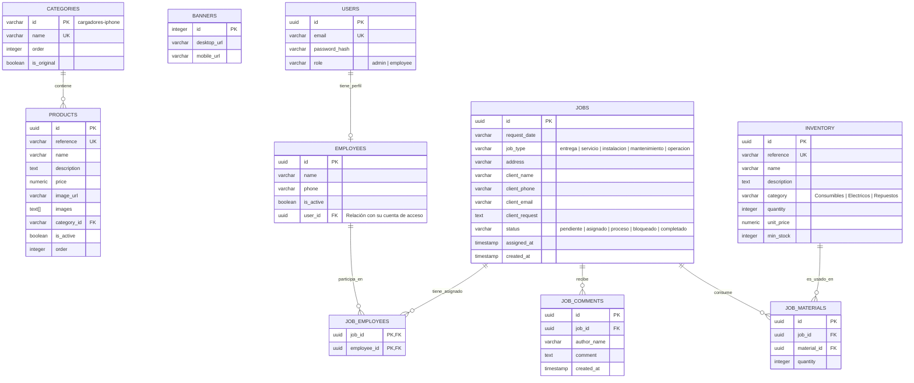

# Plan de Migración y Expansión: Catálogo + Presentación + Software de Gestión (WOT)

Este plan detalla la arquitectura definitiva para el nuevo cliente, integrando una Landing Page pública, un Catálogo de Productos y un Software Administrativo de Gestión de Servicios (Kanban, Inventario, Empleados y Reportes en PDF) bajo un servidor VPS dedicado de **precio fijo ($19.00 USD/mes)** en DigitalOcean.

---

## 👥 Roles de Usuario y Reglas de Negocio

El sistema implementará Control de Acceso Basado en Roles (RBAC) para el software administrativo:

1. **Administrador/Coordinador:**
   - Acceso total al Dashboard y estadísticas de balance.
   - Registro de nuevos trabajos e inventario.
   - Asignación de empleados a tareas.
   - Capacidad de mover cualquier tarea en el tablero y realizar CRUD completo.
2. **Empleado (Personal Operativo):**
   - Acceso restringido. Vista exclusiva de sus tareas asignadas para el día.
   - Capacidad de mover sus propias tareas de estado (ej: de *Asignado* a *En Proceso* o *Completado*).
   - Capacidad de añadir comentarios (bitácora de trabajo) y registrar materiales utilizados en la tarea.

---

## ⚙️ Integración y Lógica de Negocio Confirmada

1. **Tablero Kanban Interactivo (Jira Board):**
   - Se implementará interactividad doble: drag-and-drop físico (usando `@angular/cdk/drag-drop`) y menús de cambio de estado rápido dentro de las tarjetas.
2. **Sincronización Automática de Inventario:**
   - Al mover una tarea al estado **"Completado"**, el sistema validará los materiales registrados y **descontará automáticamente** del inventario de bodega las cantidades correspondientes.
3. **Generación del Reporte PDF Corporativo:**
   - Se implementará un botón de descarga que generará una hoja de trabajo con la estructura exacta provista por el cliente:
     - Logotipo WOT S.A.S.
     - Sección: *Información de Trabajo* (Tipo, Lugar, Estado, Fechas).
     - Sección: *Información del Cliente* (Nombre, Teléfono, Correo).
     - Sección: *Empleados Asignados* (Visualización en tarjetas redondas con avatares e iniciales).
     - Sección: *Material Requerido y Observaciones*.
     - Pie de página institucional con la fecha y hora de emisión.

---

## 🔒 Propiedad Intelectual del Código Fuente
> [!IMPORTANT]
> **Cláusula de Propiedad y Entregables:**
> El código fuente completo, incluyendo el Backend (NestJS), Frontend (Angular), scripts de base de datos, configuraciones Docker y archivos de configuración de Nginx/servidor, es **propiedad intelectual exclusiva y perpetua de WOT S.A.S.** una vez liquidado el saldo final del proyecto. El desarrollador no mantendrá derechos sobre la aplicación final y entregará acceso completo a los repositorios de código.

---

## 🔄 Clarificación sobre Migración de Datos
> [!NOTE]
> **Estado de Datos Iniciales:**
> Este proyecto es para una empresa nueva y una marca diferente. **No se requiere migración automatizada de datos históricos desde Firebase**. La base de datos PostgreSQL se iniciará en blanco (con la estructura de tablas lista) y la carga inicial de inventario, usuarios y empleados se realizará de forma manual mediante el mismo panel administrativo desarrollado.

---

## 🛡️ Entornos de Despliegue y Aseguramiento de Calidad (QA)

Para evitar fallos directamente en producción, el proyecto implementará dos entornos aislados:

1. **Entorno de Staging (Pruebas):**
   - Un subdominio de pruebas (ej: `staging.api.wot.com` o puerto alternativo del VPS).
   - Utiliza una base de datos de pruebas (`catalog_db_staging`).
   - Aquí se desplegarán las nuevas características antes de producción. Se realizará una **prueba piloto inicial con 1-2 empleados reales** para validar la usabilidad de la app móvil y del tablero antes del lanzamiento.
2. **Entorno de Producción:**
   - Servidor estable final utilizado por la empresa en el día a día.

---

## 🧪 Estrategia de Pruebas Automatizadas y Validación
*   **Backend (Pruebas Unitarias):** Se programarán pruebas automatizadas en NestJS (usando Jest) para las reglas de negocio críticas, específicamente el **descuento automático de inventario** y la **validación de stock negativo**, asegurando que nunca falle la consistencia de bodega.
*   **Pruebas de Integración:** Pruebas automatizadas sobre los endpoints de autenticación y de creación de órdenes de trabajo.

---

## 💾 Respaldos (Backups) y Recuperación ante Desastres
*   **Respaldos de Base de Datos:** Se configurará un script automatizado (`cron job`) en el VPS que realizará un volcado diario de PostgreSQL (`pg_dump`). Este archivo se cifrará y se subirá automáticamente a una carpeta privada en **DigitalOcean Spaces** para almacenamiento seguro a largo plazo.
*   **Respaldo de Sistema (DigitalOcean Droplet Backups):** Se recomienda activar la opción de backups semanales automáticos de DigitalOcean ($2.80 USD/mes adicionales) para permitir la restauración completa del sistema operativo en menos de 1 hora ante fallos críticos del hardware.

---

## Estructura de Navegación de la SPA (Angular)

*   `/*` (Público):
    - `/` -> **Landing Page** (Quiénes somos, servicios, contacto).
    - `/catalogo` -> **Catálogo de Productos** (Listado, buscador, carrito WhatsApp).
*   `/admin/*` (Privado con JWT):
    - `/admin/login` -> Ingreso (Admin y Empleados).
    - `/admin/dashboard` -> Indicadores en tiempo real `[Solo Admin]`.
    - `/admin/tablero` -> **Tablero Kanban (Jira Board)**. Los empleados solo interactúan con sus tareas.
    - `/admin/empleados` -> Perfiles y rendimiento `[Solo Admin]`.
    - `/admin/inventario` -> Control de bodega de materiales y alertas de stock mínimo `[Solo Admin/Coordinador]`.

---

## Diseño Base de Datos PostgreSQL (Relacional)

---

## 🛠️ Plan de Despliegue Docker (Producción)

Tanto la base de datos relacional (PostgreSQL), la API de NestJS, y el Frontend compilado en Angular (servido por Nginx) se empaquetarán en un único `docker-compose.yml` para desplegarse con un solo comando en el VPS de $14 USD/mes de DigitalOcean.

---

## ⏱️ Estimación de Tiempos y Cotización Comercial

### Desglose por Módulos de Trabajo (Ajustado con Margen de QA y Pruebas)

| Fase / Módulo | Alcance Técnico | Horas Estimadas |
|---|---|---|
| **Fase 1: Infraestructura y Base API** | Estructurar NestJS, conexión PostgreSQL vía Prisma ORM, autenticación JWT con roles y docker-compose multi-entorno (Staging/Production). | **12 - 16 hrs** |
| **Fase 2: Landing Page y Catálogo** | Landing Page en Angular. Migrar servicios de catálogo a NestJS REST HTTP. Adaptar subida de imágenes a DigitalOcean Spaces. | **16 - 20 hrs** |
| **Fase 3: Tablero Kanban (Jira Board)** | Modelos de trabajos y comentarios. UI Kanban en Angular con CDK (Drag & Drop). Vista restringida y responsive para operarios. | **24 - 30 hrs** |
| **Fase 4: Inventario y Descuento Automático** | CRUD bodega. Reglas en NestJS de reducción automática y alertas. Pruebas unitarias para esta lógica transaccional. | **14 - 18 hrs** |
| **Fase 5: Reporte PDF Corporativo y QA** | Generador de PDF en backend/frontend. Pruebas visuales y pruebas de impresión en dispositivos móviles. | **8 - 12 hrs** |
| **Fase 6: Despliegue, Backups y Piloto** | Servidor, dominio, HTTPS SSL. Configurar script de backups automáticos y pilotaje inicial con 1-2 empleados. | **10 - 14 hrs** |
| **TOTAL ESTIMADO** | **Desarrollo completo llave en mano + pruebas de integración.** | **84 - 110 horas** |

### Tiempos de Entrega
*   **Dedicación:** ~20 horas por semana (tiempo parcial).
*   **Plazo de Entrega:** **4 a 5.5 semanas** de desarrollo (incluyendo pruebas integrales con el cliente y período de marcha blanca).

### Cotización Sugerida (Valor Comercial)
Este proyecto es un **ERP de operaciones a medida** para la gestión logística de servicios de la empresa, lo cual tiene un valor de mercado alto.

*   **Tarifa por hora sugerida:** $30 - $40 USD / hora.
*   **Presupuesto estimado en USD:** **$2,300 - $3,200 USD** (ignorado a petición del usuario, conservado solo como valor comercial de referencia).
*   **Presupuesto sugerido en COP (Colombia):** **$9.500.000 - $13.000.000 COP** (según TRM vigente).
*   *Nota Comercial: Se recomienda estructurar en pagos por hitos (50% anticipo, 30% tras hito funcional del tablero, 20% al despliegue final y capacitación).*
